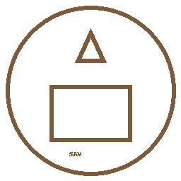

# Symbols & Arms

{ width="260" }

**Motto:** _Ex Silva, Virtus_ — **From the Forest, Strength.**

- **Lion** upon the Lithuanian tricolor — courage and authority.
- **Bear** — the guardian spirit of the land and of the duke.
