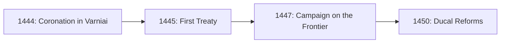

# Timelines

## Annals (High-Level)
- **1444** — Coronation of Rolandas in Varniai; army set at 6,000.
- **1445–1449** — _To be recorded._

## (Optional) Mermaid Timeline

```mermaid
flowchart LR
  A1444[1444: Coronation in Varniai] --> A1445[1445: First Treaty]
  A1445 --> A1447[1447: Campaign on the Frontier]
  A1447 --> A1450[1450: Ducal Reforms]
```
